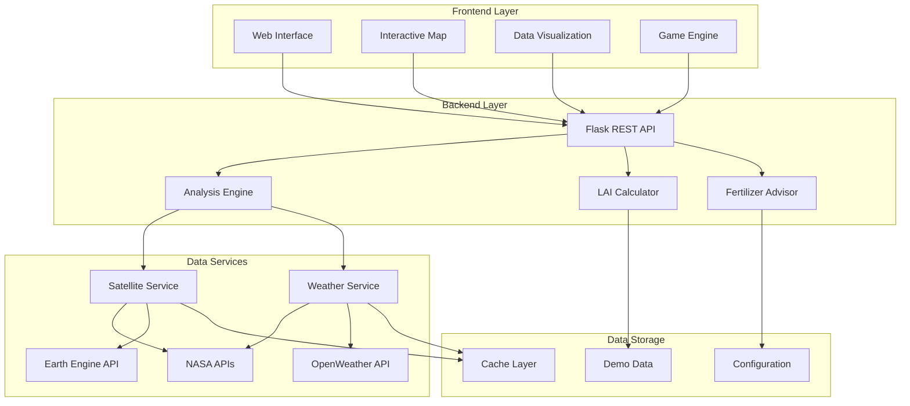
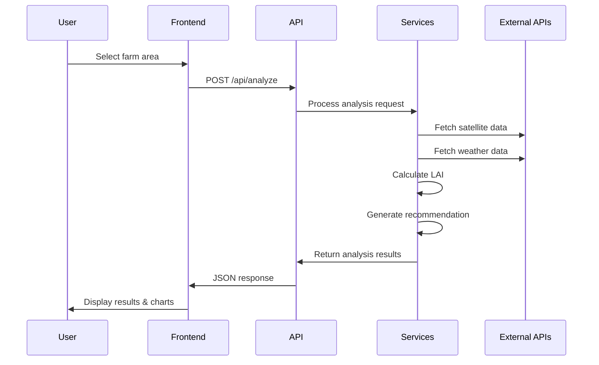
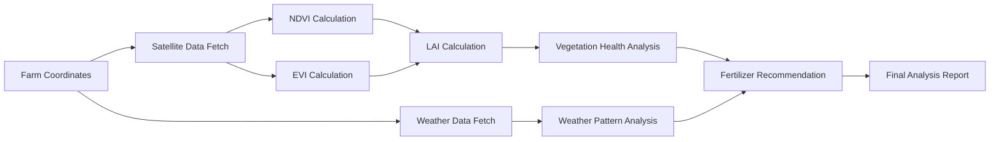
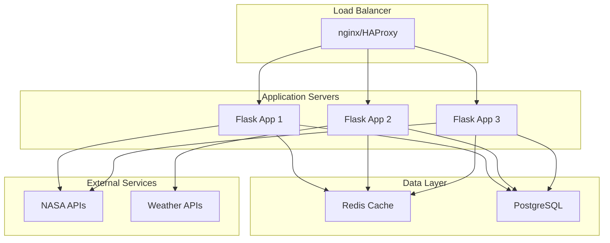
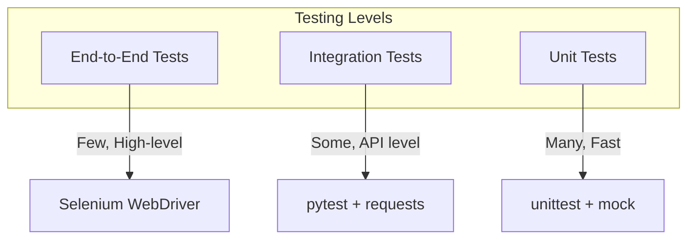
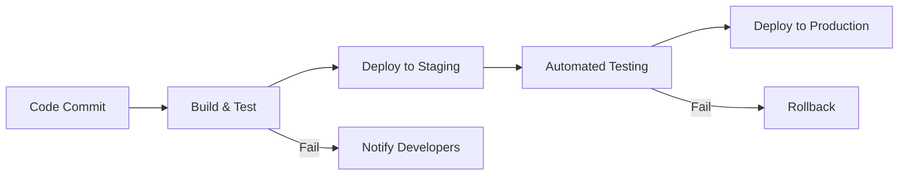

# Agricultural Analysis Game - Architecture Documentation

## 🏗️ System Architecture

The Agricultural Analysis Game is built as a modern web application with a clear separation between frontend and backend components, designed for scalability and maintainability.

## 📊 Architecture Diagram



## 🎯 Component Overview

### Frontend Components

#### 1. Web Interface (`frontend/index.html`)
- **Purpose**: Main user interface for the game
- **Technologies**: HTML5, CSS3, Bootstrap 5
- **Features**: Responsive design, accessibility support, modern UI components

#### 2. Interactive Map (`frontend/js/map.js`)
- **Purpose**: Geospatial interface for farm selection
- **Technologies**: Leaflet.js, OpenStreetMap tiles
- **Features**: 
  - Pan/zoom navigation
  - Rectangle selection tool
  - Satellite imagery overlay
  - Sample farm markers

#### 3. Data Visualization (`frontend/js/analysis.js`)
- **Purpose**: Charts and graphs for data analysis
- **Technologies**: Chart.js
- **Features**:
  - Time-series weather charts
  - LAI progression graphs
  - Soil condition visualizations
  - Interactive data exploration

#### 4. Game Engine (`frontend/js/game.js`)
- **Purpose**: Game mechanics and progression
- **Features**:
  - Scoring system
  - Level progression
  - Achievement system
  - Progress tracking

### Backend Components

#### 1. Flask REST API (`backend/app.py`)
- **Purpose**: Main API server and request routing
- **Technologies**: Flask, Flask-RESTful, Flask-CORS
- **Endpoints**:
  - `/api/health` - Health check
  - `/api/analyze` - Complete farm analysis
  - `/api/satellite/imagery` - Satellite imagery
  - `/api/weather` - Weather data
  - `/api/lai/calculate` - LAI calculations
  - `/api/fertilizer/recommend` - Fertilizer recommendations

#### 2. Analysis Engine (`backend/services/`)
- **Purpose**: Coordinate data processing and analysis
- **Components**:
  - Satellite data processing
  - Weather data analysis
  - LAI calculations
  - Fertilizer recommendations

#### 3. Data Services

##### Satellite Service (`satellite_service.py`)
- **Purpose**: Fetch and process satellite imagery and vegetation indices
- **Data Sources**:
  - NASA Earthdata
  - Sentinel-2 via Earth Engine
  - MODIS data
- **Processing**:
  - NDVI/EVI calculation
  - Cloud filtering
  - Temporal analysis

##### Weather Service (`weather_service.py`)
- **Purpose**: Collect and analyze weather data
- **Data Sources**:
  - NASA POWER API
  - OpenWeatherMap API
- **Processing**:
  - Historical weather analysis
  - Forecast data
  - Agricultural weather indices

##### LAI Calculator (`lai_calculator.py`)
- **Purpose**: Calculate Leaf Area Index from satellite data
- **Methods**:
  - NDVI-based exponential
  - NDVI-based linear
  - EVI-based calculation
  - Combined approach
- **Features**:
  - Confidence scoring
  - Trend analysis
  - Health classification

##### Fertilizer Advisor (`fertilizer_advisor.py`)
- **Purpose**: Generate intelligent fertilizer recommendations
- **Analysis Factors**:
  - Vegetation health (LAI)
  - Soil conditions
  - Weather patterns
  - Crop type considerations
- **Output**:
  - Recommendation with confidence
  - Fertilizer type and rate
  - Application timing
  - Expected benefits

## 🔄 Data Flow

### 1. User Interaction Flow



### 2. Data Processing Pipeline



## 🛠️ Technology Stack

### Frontend Technologies

| Component | Technology | Purpose |
|-----------|------------|---------|
| **UI Framework** | HTML5, CSS3, Bootstrap 5 | Responsive user interface |
| **Mapping** | Leaflet.js | Interactive maps |
| **Charts** | Chart.js | Data visualization |
| **HTTP Client** | Fetch API | API communication |
| **State Management** | Vanilla JavaScript | Application state |

### Backend Technologies

| Component | Technology | Purpose |
|-----------|------------|---------|
| **Web Framework** | Flask | REST API server |
| **API Framework** | Flask-RESTful | RESTful endpoints |
| **CORS** | Flask-CORS | Cross-origin requests |
| **Data Processing** | NumPy, Pandas | Scientific computing |
| **Geospatial** | Rasterio, GeoPandas | Spatial data processing |
| **HTTP Client** | Requests | External API calls |

### External APIs

| Service | Purpose | Data Type |
|---------|---------|-----------|
| **NASA POWER** | Weather and solar data | Meteorological |
| **NASA Earthdata** | Satellite imagery | Remote sensing |
| **OpenWeatherMap** | Current weather | Meteorological |
| **Google Earth Engine** | Satellite data processing | Remote sensing |

## 🔧 Configuration Management

### Environment Configuration

```python
# config.py structure
class Config:
    # Flask settings
    SECRET_KEY = os.getenv('SECRET_KEY')
    DEBUG = os.getenv('FLASK_DEBUG', 'False').lower() == 'true'
    
    # API Keys
    NASA_API_KEY = os.getenv('NASA_API_KEY')
    OPENWEATHER_API_KEY = os.getenv('OPENWEATHER_API_KEY')
    
    # Processing limits
    MAX_ANALYSIS_DAYS = 90
    MAX_FARM_SIZE_HECTARES = 10000
```

### Crop-Specific Configurations

```python
CROP_CONFIGS = {
    'corn': {
        'lai_thresholds': {'poor': 1.5, 'good': 5.0, 'excellent': 7.0},
        'optimal_temperature': (18, 30),
        'fertilizer_rates': {'nitrogen': 150, 'phosphorus': 60}
    }
}
```

## 📊 Data Models

### Core Data Structures

```python
@dataclass
class FarmBounds:
    north: float
    south: float
    east: float
    west: float

@dataclass
class LAIData:
    date: str
    lai_value: float
    confidence: float
    calculation_method: str

@dataclass
class FertilizerRecommendation:
    needs_fertilizer: bool
    confidence: float
    reasoning: str
    fertilizer_type: Optional[str]
    application_rate: Optional[float]
```

## 🚀 Performance Considerations

### Optimization Strategies

1. **Caching**
   - Weather data cached for 1 hour
   - Satellite data cached for 2 hours
   - LAI calculations cached by coordinates

2. **Rate Limiting**
   - Analysis endpoints: 10 requests/minute
   - Data endpoints: 60 requests/minute

3. **Data Processing**
   - Asynchronous API calls where possible
   - Efficient NumPy operations for calculations
   - Minimal data transfer between services

4. **Frontend Optimization**
   - Lazy loading of charts
   - Efficient DOM updates
   - Compressed assets

## 🔒 Security Considerations

### API Security

1. **Input Validation**
   - Coordinate bounds validation
   - Parameter type checking
   - SQL injection prevention

2. **Rate Limiting**
   - Per-IP request limits
   - API endpoint specific limits

3. **Error Handling**
   - Sanitized error messages
   - No sensitive data in responses
   - Proper HTTP status codes

### Data Privacy

1. **No Personal Data Storage**
   - Only geographic coordinates processed
   - No user identification required

2. **API Key Protection**
   - Environment variable storage
   - No client-side exposure

## 📈 Scalability Architecture

### Horizontal Scaling Options



### Microservices Migration Path

1. **Phase 1**: Monolithic Flask app (current)
2. **Phase 2**: Separate data services
3. **Phase 3**: Independent microservices
4. **Phase 4**: Container orchestration

## 🧪 Testing Strategy

### Test Pyramid



### Test Coverage Areas

1. **Unit Tests**
   - LAI calculation algorithms
   - Fertilizer recommendation logic
   - Data validation functions

2. **Integration Tests**
   - API endpoint responses
   - External API integration
   - Database operations

3. **End-to-End Tests**
   - Complete user workflows
   - Cross-browser compatibility
   - Performance benchmarks

## 🔄 Deployment Pipeline

### CI/CD Workflow



### Environment Stages

1. **Development**: Local development with demo data
2. **Staging**: Production-like environment for testing
3. **Production**: Live environment with real APIs

## 📚 Documentation Strategy

### Documentation Types

1. **API Documentation**: OpenAPI/Swagger specs
2. **Code Documentation**: Inline comments and docstrings
3. **User Documentation**: Setup guides and tutorials
4. **Architecture Documentation**: This document

### Maintenance

- Documentation updated with each release
- API changes documented in changelog
- User guides updated for new features
- Architecture reviews quarterly

## 🔮 Future Enhancements

### Planned Features

1. **Advanced Analytics**
   - Machine learning models for yield prediction
   - Historical trend analysis
   - Crop rotation recommendations

2. **Real-time Data**
   - IoT sensor integration
   - Real-time satellite feeds
   - Weather station data

3. **Mobile Application**
   - Native mobile apps
   - Offline functionality
   - GPS-based farm detection

4. **Collaboration Features**
   - Multi-user farms
   - Expert consultations
   - Community sharing

### Technical Improvements

1. **Performance**
   - GraphQL API
   - WebSocket real-time updates
   - Edge computing for faster analysis

2. **Reliability**
   - Microservices architecture
   - Circuit breakers
   - Graceful degradation

3. **Observability**
   - Comprehensive logging
   - Metrics and monitoring
   - Distributed tracing